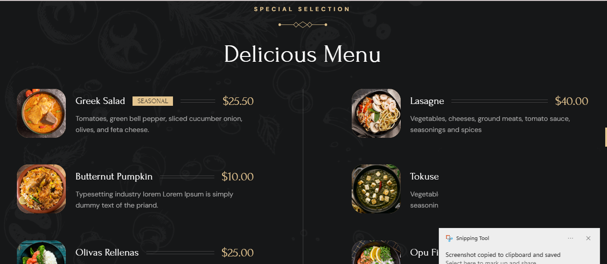

 
 <h2 align="center">Grilli - Restaurant Website</h2>

  Grilli is a fully responsive restaurant website,  Responsive for all devices, build using HTML, CSS, and JavaScript.

  <a href="https://github.com/ankitab78"><strong>➥ Live Demo</strong></a>

 

### Demo Screeshots

### Prerequisites

Before you begin, ensure you have met the following requirements:

* [Git](https://git-scm.com/downloads "Download Git") must be installed on your operating system.

### Contact

If you want to contact with me you can reach me at [Email](ankitab7839@gmail.com)

